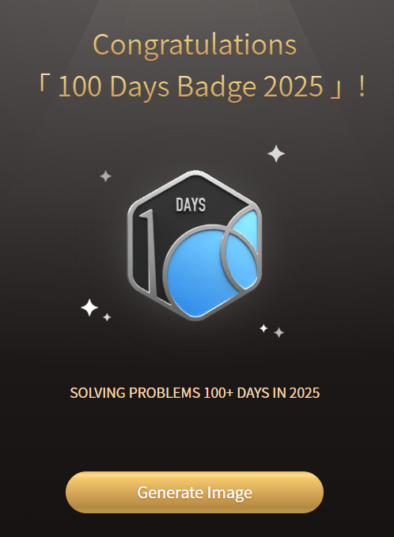

# Preparation
## 📅 12 May 2025

- ✅ Solved LeetCode Problems [2094. Finding 3-Digit Even Numbers](https://leetcode.com/problems/finding-3-digit-even-numbers/) & [242. Valid Anagram](https://leetcode.com/problems/valid-anagram/). Used the same concept in both of them - `Counter()` method. It functions as a dictionary where keys are elements and values are their counts.
- 📘 Worked on DAIICT sample paper (see `DAIICT Paper.pdf` in the repo)
  - Completed: Half of the paper
  - Plan: Remaining half to be completed tomorrow
  - Solved paper: `DAIICT Solution 1.pdf`
- 🚗 Car Driving Practice (5:30 PM)
  - Learnt reverse parking and reverse 8-loop
  - Drove in traffic for some time
  - Papa mentioned I need more confidence and practice
- 📚 Studied:
  - Matrix Rank ([ChatGPT Link](https://chatgpt.com/c/6821a04a-2d90-800e-bfcd-d1f2ceb35306))
  - Preorder, Postorder, Inorder Traversals ([ChatGPT Link](https://chatgpt.com/c/6822075a-cbc4-800e-b803-abd81251457e))
  - Spanning Tree ([ChatGPT Link](https://chatgpt.com/c/682207f4-e5c4-800e-91b5-fef82d462eca))

That's it for the first day! **Bye ❤️**

## 📅 13 & 14 May 2025

- ✅ Solved LeetCode Problems [3335. Total Characters in String After Transformations I](https://leetcode.com/problems/total-characters-in-string-after-transformations-i/description/) & [3337. Total Characters in String After Transformations II](https://leetcode.com/problems/total-characters-in-string-after-transformations-ii/description/).
- 📘 Worked on DAIICT sample paper (see `DAIICT Paper.pdf` in the repo)
  - Completed: Rest of the paper
  - Plan: Start subject by subject preparation from tomorrow
  - Solved paper: `DAIICT Solution 2.pdf`
- 🚗 Car Driving Practice (5:30 PM)
  - Mastered reverse parking and Gear Control
  - Drove in traffic for some time
  - Papa mentioned I need to focus while reversing the car
- 📚 Studied:
  - 3D Vectors, Vector Spaces, Subspaces, and Dimensions ([ChatGPT Link](https://chatgpt.com/c/6824a2b7-d3a4-800e-ba92-dbb7880f1cf5))
  - Shared Ethernet Bus and Its Protocols ([ChatGPT Link](https://chatgpt.com/c/6824a7a5-d60c-800e-8f5a-10bcf891d9dc)) `CSMA/CD was interesting!`
  - IP Addressing and Networking Concepts ([ChatGPT Link](https://chatgpt.com/c/6824a8da-38bc-800e-9da4-254e8a0f994d)) `Solved an easy question on NAT`
  - Transmission Control Protocol (TCP) ([ChatGPT Link](https://chatgpt.com/c/6824a573-5a6c-800e-8153-2c147f4c2f8c)) `Learnt a new topic called Estimated Round Trip Time Calculation and various TCP flag pairs`
  - SQL Joins ([ChatGPT Link](https://chatgpt.com/c/6824aa7c-4628-800e-945a-6aa7b57fb9fd))
  - Functional Dependencies, Normal Forms, and Keys ([ChatGPT Link](https://chatgpt.com/c/6824ab76-bffc-800e-85a2-110712d6a377))

That's it! **Bye ❤️**

## 📅 15 May 2025

- ✅ Solved LeetCode Problem [2900. Longest Unequal Adjacent Groups Subsequence I](https://leetcode.com/problems/longest-unequal-adjacent-groups-subsequence-i/description/) Achieved 100 Days badge with 143 problems solved today! 🪙
  

  

- 📚 Studied:
  - Graph Theory from Physics Wallah Lecture, where I learnt :
      1. Introduction:
        Graph theory is essential in math and computer science, studied through logic, set theory, and combinatorics.
      2. History:
        Originated in 1736 with a problem about visiting locations—birth of graph theory.
      3. Basic Definitions:
        A graph = vertices (nodes) + edges (connections).
        Directed graphs use ordered pairs; undirected use unordered.
      4. Key Concepts:
        Self-loops: edge connects a vertex to itself.
        Parallel edges: multiple edges between the same vertices.
        Degree: number of edges connected to a vertex.
      5. Important Theorems:
        Sum of all vertex degrees = 2 × number of edges.
        Pendant vertex: degree 1. Isolated vertex: degree 0.
      6. Types of Graphs:
        Simple, multi, and pseudo graphs, each with specific rules.
        Max degree in a simple graph = n – 1.
      7. Applications:
        Used in solving real-world problems, especially in algorithms and computing.
      8. Advanced Topics:
        Includes directed graphs, graph complexity, and computational methods.
      9. Graph Limits:
        Understanding vertex/edge limits helps in valid graph construction.

That's it the first day! **Bye ❤️**

